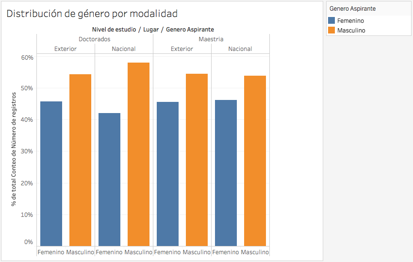

<link rel="stylesheet" type="text/css" href="assets/css/main.css" />
<script type="text/javascript" src="https://d3js.org/d3.v4.min.js"></script> 

## ASPIRANTES A BECAS DE FORMACIÓN DE ALTO NIVEL PARA LAS REGIONES 2014 A OCT 2016

Con el fin de identificar el grado de participación de aspirantes en la oferta de becas de formación de algo nivel para las regiones, se ha analizado _[este](https://www.datos.gov.co/Ciencia-Tecnolog-a-e-Innovaci-n/ASPIRANTES-A-BECAS-DE-FORMACION-DE-ALTO-NIVEL-PARA/j6gt-keey)_  conjunto de datos que disponible se encuentra disponible en el [portal de datos abiertos de Colombia](https://www.datos.gov.co), el objetivo es identificar comportamientos interesantes y visualizarlos de manera adecuada.

Este dataset presenta 6050 registros con *"información sobre profesionales inscritos en las diferentes convocatorias de formación de recurso humano de alto nivel para fortalecer capacidades en Ciencia, Tecnología e Innovación en las regiones años 2014 a octubre de 2016". Fuente: [Descripción del data set](https://www.datos.gov.co/Ciencia-Tecnolog-a-e-Innovaci-n/ASPIRANTES-A-BECAS-DE-FORMACION-DE-ALTO-NIVEL-PARA/j6gt-keey)*

### Insights

- En el año 2014 se presentó un mayor número de aspirantes a las convocatorias en comparación a los años 2015 y 2016.
- En el 2015 el número de aspirantes fue menor dada la disminución en programas ofertados, solo se ofertaron en 4 departamentos.
- Los departamento de Atlántico, Magdalena y Cesar han sido escogidos más de una vez como lugar de convocatoria.
- Los programas nacionales tienen mayor demanda que los programas en el exterior.
- Los aspirantes están más interesados en la oferta de maestrías que en la oferta de doctorados.
- Se mantiene una proporción de participación aproximadamente de 55% para hombres y 45% para mujeres en todas las convocatoria, sin importar la modalidad de esta.
- El género influye en la edad preferida para realizar estudios de alto nivel, se evidencia que las mujeres prefieren estudiar más jovenes.
- En el caso de las investigaciones, el genero no afecta la edad promedio de los aspirantes aunque se evidencia que las mujeres tienen interés de investigar en edad más avanzada que los hombres.

### visualizaciones

Las anteriores conclusiones se soportan en las siguientes gráficas.





<!-- ```markdown
Syntax highlighted code block

# Header 1
## Header 2
### Header 3

- Bulleted
- List

1. Numbered
2. List

**Bold** and _Italic_ and `Code` text

[Link](url) and 
``` -->

<!-- For more details see [GitHub Flavored Markdown](https://guides.github.com/features/mastering-markdown/). -->


